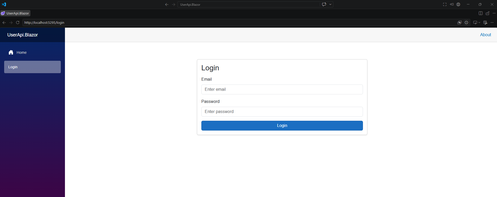
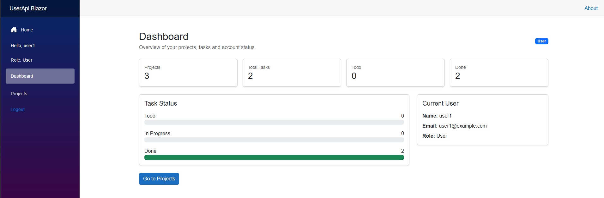
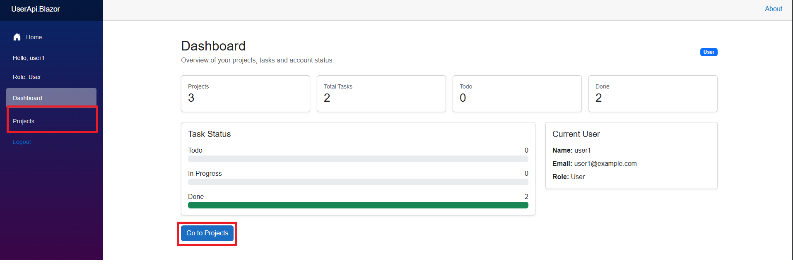
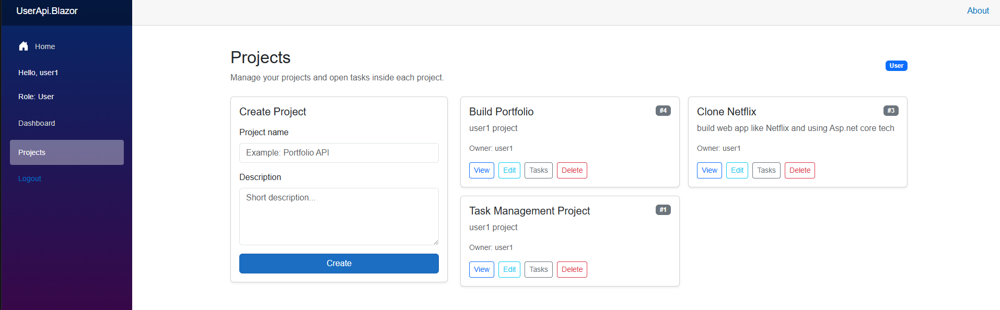
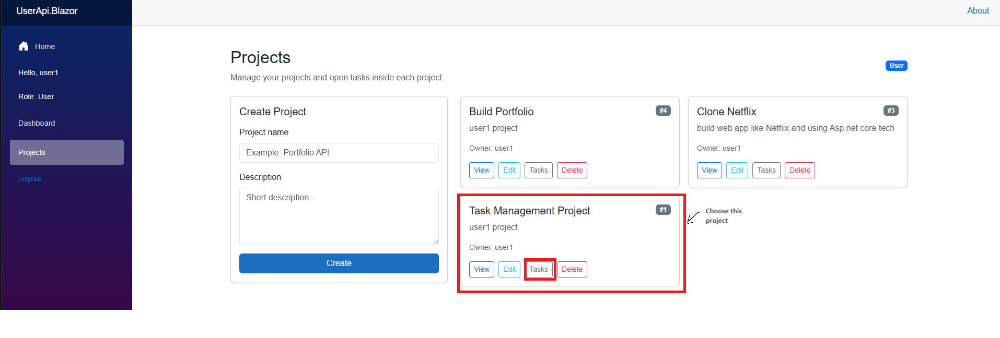
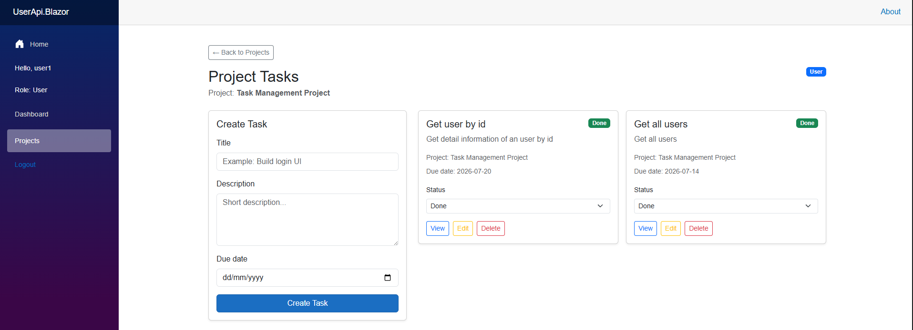
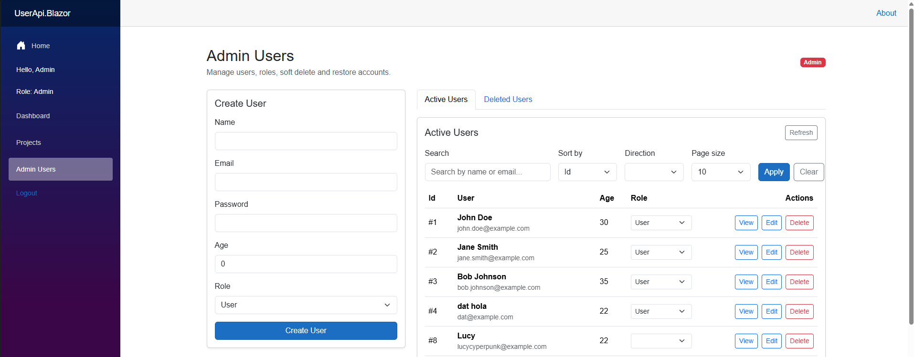
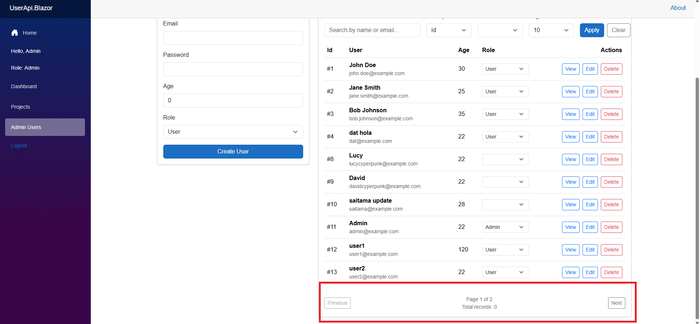
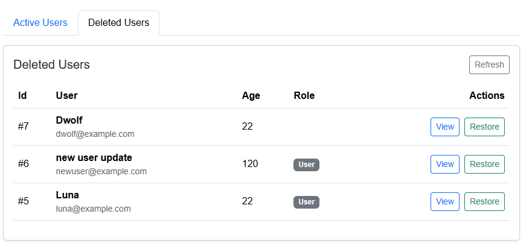

# User Task Management API - Frontend
This is the continuation of the project "User Task Management API". This project build with Blazor and access backend API to implement project functions on the user interface.

# Tech Stack
- C#
- Blazor Assembly template
- Bootstrap 5

# Main Features
Build UI basic and connect with Backend API project for using features like: `Login, Logout, Mange Projects/Tasks/Users(used by Admin)`.

# View UI 
1. Login Page



2. Dashboard Page

- When user login account, the first page that appears is Dashboard.



3. Projects Page

- In Dashboard page, you can use the button `Go to Projects` or `Projects` in navbar.



- In Projects page is showed with these projects of user login.



- After view a list of projects, you can use features as: `Create/View/Edit/Delect`. With feature `Tasks` on each project, when you click, it navigated to Tasks Item of this Project.

4. ProjectTasks Page

- ProjectTasks Page is the page to show about Task Item of the Project which you choose.



- Now it is showing tasks in this project. In this you can view tasks and use features as: `Create/View/Edit/Delete`



5. Admin Users Active Tab

- Above those pages, view Admin is similar but has different between role Admin/User which rules in Backend API

- So now we see Admin Users page


- After see overview, you can see in navbar which has `Admin Users` navitem when user login which role is Admin

- In this page, you can use features as: `Create, View Users, Change user role, Search user by name, Sort by value, Direction by desc or asc and Paging`.



6. Admin Users Deleted Tab

- In Admin Users page, this also has one function which show users is delected. You can see the tab `Active Users` and `Deleted Users`, you can swith them .



- In here, you can restore any user is delected.

# How to run this project

1. Clone repository:

```bash
git clone https://github.com/DTPGH/UserApi-Blazor-fe.git
cd UserApi-Blazor-fe
```

2. Run the web
```bash
dotnet run
```

⚠️ When you run this web, you also need run project Backend API.